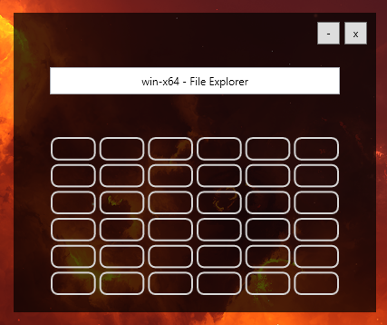
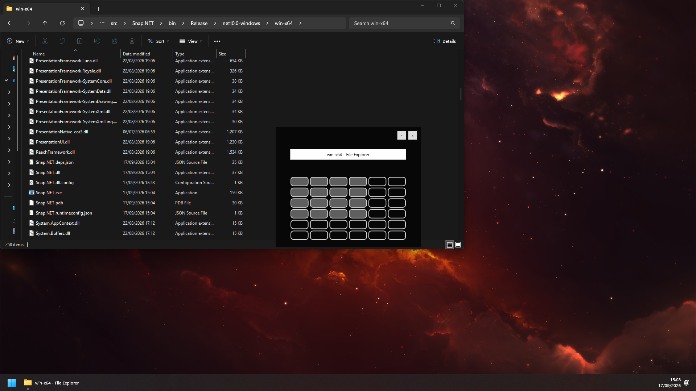

# Snap.NET

Snap.NET is a Windows WPF utility for positioning the focused window, particularly on multi-monitor setups. It is archived: Microsoft PowerToys and Windows 11 now cover the original use case.

## Screenshots

#### Application Overlay


#### Successful resize (drag with mouse)


## Use

- Press `Ctrl+Space` to display the focused window and select the target area on the monitor grid.
- Click grid cells to choose the area to which the focused window is resized.
- Press `Ctrl+Shift+Space` to exit.

Settings are stored in `%AppData%\SnapNET`.

## Build

Build on Windows with the .NET 10 SDK:

```powershell
dotnet build Snap.NET.sln --configuration Release
```

The self-contained Windows output is written to `bin\Release\net10.0-windows\win-x64\`. Run `Snap.NET.exe`; no .NET installation is required on the target computer.

The release build was last verified successfully. Because this is a Windows-only WPF application, capture a UI screenshot from a Windows desktop after launching the generated executable.
